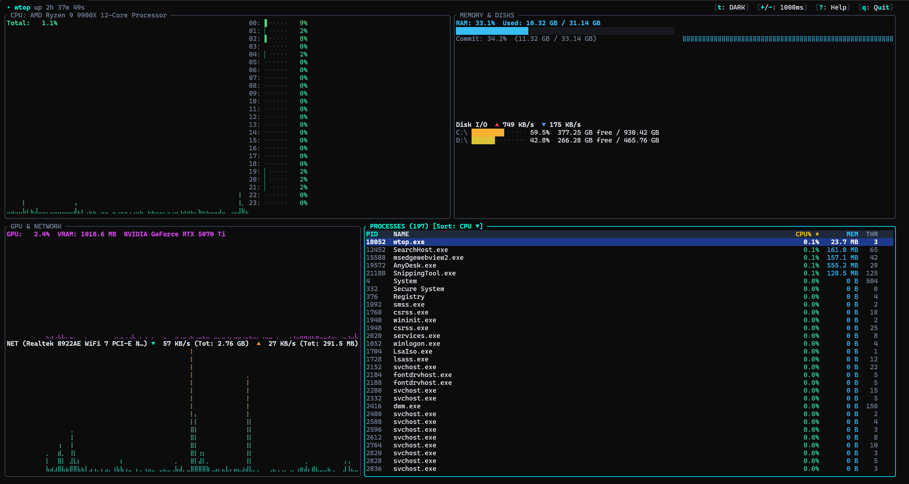

# wtop - Windows Terminal Resource Monitor
> A TUI resource monitor for Windows with the aesthetic and visual density of `btop`, designed to have a **literally minimal** footprint on system resources.



[](https://www.rust-lang.org/)
[](https://www.microsoft.com/windows)
[](https://ratatui.rs/)
[](https://crates.io/crates/crossterm)
[](https://github.com/Vinello28/wtop/releases)
[](LICENSE)

**[vinello28.github.io/wtop &rarr;](https://vinello28.github.io/wtop/)**

---

## Key Features

- **Full Hardware Component Visualization**:
  - **CPU**: Global utilization with a high-density Braille history graph + per-logical-core load bars (up to 128 cores) with a green → amber → coral red gradient. CPU model extracted directly from CPUID (zero overhead).
  - **RAM & Swap/Commit**: Used, available, and total physical memory, commit limit, and a dedicated history graph.
  - **Disks & I/O**: Mounted volumes (C:, D:, etc.) with free/total space and real-time throughput (MB/s or KB/s) for both read and write via high-performance counters.
  - **GPU**: 3D/Compute engine utilization percentage (WDDM DirectX) + allocated dedicated VRAM + graphics adapter name.
  - **Network**: Real-time Download and Upload traffic monitoring (KB/s, MB/s) via the native IP Helper interface table + total session downloaded/uploaded + active adapter name.
  - **Battery**: Charge percentage, AC/charging/discharging state, and remaining time on laptops, with its own history graph. Shown in the free space below **Disks & I/O** whenever a battery is present; hidden entirely on desktops.
  - **Processes**: Advanced process management sortable by CPU%, RSS Memory, PID, or Name, with instant search/filter (`/`) and process termination (`x` / `Delete`).
- **Sub-Pixel Braille Graphics Engine**:
  - Uses Braille Unicode characters (`U+2800`–`U+28FF`) for a 2x4 sub-pixel resolution per text cell, producing smooth, dense curves identical to `btop`.
- **Dual 24-bit TrueColor Theme**:
  - **Dark Theme**: Dark charcoal background, cyan/neon accents, and RGB gradients.
  - **Light Theme**: Alabaster/paper background, high-contrast dark accents for bright environments.
  - `t` shortcut to instantly switch between themes (saved in configuration).
- **Dynamic Sampling Rate**:
  - Adjustable on the fly with `+` and `-` (250ms, 500ms, 1000ms, 2000ms, 5000ms).
- **Zero-WMI Architecture**:
  - No use of WMI (`WmiPrvSE.exe`), zero slow COM serialization.
  - All metrics are collected via direct Win32 / NTDLL kernel calls (`NtQuerySystemInformation`, `GlobalMemoryStatusEx`, `GetIfTable2`, native PDH).
- **Isolated Collector Thread**:
  - A dedicated worker thread samples low-level hardware and passes immutable snapshots to the render thread; the UI responds instantly at 60 FPS and never blocks.

---

## Performance Measured on Windows 11

| Metric | Measured Result |
| :--- | :--- |
| **RAM Footprint (Working Set)** | **~18 MB** |
| **CPU Usage (active)** | **< 0.05%** (~0.3s CPU time over a 5s sampling window) |
| **Binary Size (.exe)** | **2.6 MB** (single static file, zero external dependencies) |
| **Terminal Flickering** | **0%** (VT100 / Virtual Terminal Processing double-buffering) |

---

## Supported Platforms

GitHub releases publish a native binary for each architecture:

| Architecture | Asset | Notes |
| :--- | :--- | :--- |
| **x86_64** (Intel/AMD) | `wtop.exe` | Primary build, directly tested |
| **ARM64** (Windows on ARM, e.g. Snapdragon X) | `wtop-arm64.exe` | Native build, cross-compiled in CI |

The in-app auto-updater automatically detects the architecture of the running binary and always downloads the correct asset.

---

## Keyboard Shortcuts

| Key | Action |
| :--- | :--- |
| `Tab` / `Shift-Tab` | Switch the active (focused) panel |
| `↑` / `↓` or `k` / `j` | Scroll the process list |
| `PgUp` / `PgDn` | Jump 10 processes up / down |
| `Home` / `End` | Go to the start / end of the process list |
| `c` | Sort processes by **CPU %** |
| `m` | Sort processes by **RAM Memory** |
| `p` | Sort processes by **PID** |
| `n` | Sort processes by **Name** |
| `d` | Reverse sort direction (Ascending / Descending) |
| `/` | Enable real-time process search/filter |
| `x` or `Delete` | Terminate the selected process (with `y`/`n` confirmation prompt) |
| `t` | Toggle theme (**Dark** ↔ **Light**) |
| `+` / `-` | Increase or decrease the sampling rate |
| `u` | Apply the update if a new version is available |
| `g` | Open the developer's GitHub profile in your default browser |
| `?` or `h` | Show the help window with all shortcuts |
| `q` or `Esc` | Quit wtop / Clear active filter |

---

## Building and Running

### Run Directly
```powershell
.\target\release\wtop.exe
```

### Build from Source
```powershell
cargo build --release
```

User configuration (preferred theme, sampling rate, sort order) is automatically saved to `%APPDATA%\wtop\config.json`.

### Command-Line / Snapshot Mode

For scripting or logging, wtop can print a single sample and exit instead of launching the TUI:

```powershell
wtop --once      # Plain-text snapshot
wtop --json      # JSON snapshot (full process list, no truncation)
wtop -h, --help  # Usage
```

A snapshot takes ~500ms to report accurate rates (CPU%, disk/network throughput, per-process CPU%), since those metrics need two samples to compute a delta.

---

## License

wtop is licensed under the [PolyForm Noncommercial License 1.0.0](LICENSE). You're free to use, modify, and share it for any noncommercial purpose (personal use, research, education, hobby projects); commercial use requires a separate agreement with the copyright holder.
